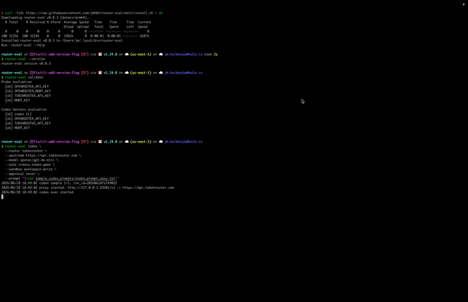

# router-eval

CLI and transparent measurement proxy for capturing LLM router request metrics — cost, latency, and reliability — via synthetic probes and a Codex harness.

<p align="center">
  
</p>

## Prerequisites

- Install the latest CLI release (auto-detects OS/arch): `curl -fsSL https://raw.githubusercontent.com/jmhbh/router-eval/main/install.sh | sh`
- Codex CLI installed when running the Codex harness.

Run the `validate` cmd to ensure necessary environment variables are set.


## Usage

The CLI supports gathering metrics around simple request probes that can be visualized in the UI
or alternatively a task through a harness. Currently, only codex is supported as a harness.

## Running probes

- `simple_request` — minimal non-streaming request for simple latency benchmarking
- `streaming_responses` — streaming request with a length-pinned output (capped via
  `max_output_tokens`) to measure TTFT.

simple non-streaming request using TokenRouter:

```sh
router-eval probe \
  --router tokenrouter \
  --upstream https://api.tokenrouter.com \
  --name simple_request \
  --model openai/gpt-4o-mini \
  --samples 100
```

stremaing request using TokenRouter:

```sh
router-eval probe \
  --router tokenrouter \
  --upstream https://api.tokenrouter.com \
  --name streaming_responses \
  --model openai/gpt-4o-mini \
  --samples 100
```

simple non-streaming request using OpenRouter:

```sh
router-eval probe \
  --router openrouter \
  --upstream https://openrouter.ai/api \
  --name simple_request \
  --model openai/gpt-4o-mini \
  --samples 100
```

streaming request using OpenRouter:

```sh
router-eval probe \
  --router openrouter \
  --upstream https://openrouter.ai/api \
  --name streaming_responses \
  --model openai/gpt-4o-mini \
  --samples 100
```

## Running a Codex task

Run a Codex task through TokenRouter using the measurement proxy.

Measure metrics for creating the classic game snake using Codex through OpenRouter:

```sh
router-eval codex \
  --router openrouter \
  --upstream https://openrouter.ai/api \
  --model openai/gpt-4o-mini \
  --task create-snake-game \
  --sandbox workspace-write \
  --approval never \
  --prompt "$(cat sample_codex_prompts/snake_prompt_easy.txt)"
  --samples 1
```

Measure metrics for creating the classic game snake using Codex through TokenRouter:

```sh
router-eval codex \
  --router tokenrouter \
  --upstream https://api.tokenrouter.com \
  --model openai/gpt-4o-mini \
  --task create-snake-game \
  --sandbox workspace-write \
  --approval never \
  --prompt "$(cat sample_codex_prompts/snake_prompt_easy.txt)" \
  --samples 1
```

The harness creates a temporary `CODEX_HOME` which is cleaned up after every run.
This allows us to point Codex at the local proxy via
generated config, and stores Codex stdout/stderr under the run artifact
directory. It does not modify your existing codex configuration.

The `codex` command also supports the `--sample` argument but it is only recommended
on small tasks to capture benchmarking data.

## UI

Serve the local dashboard in the foreground (defaults to port 8080):

```sh
bin/router-eval ui-serve
```
